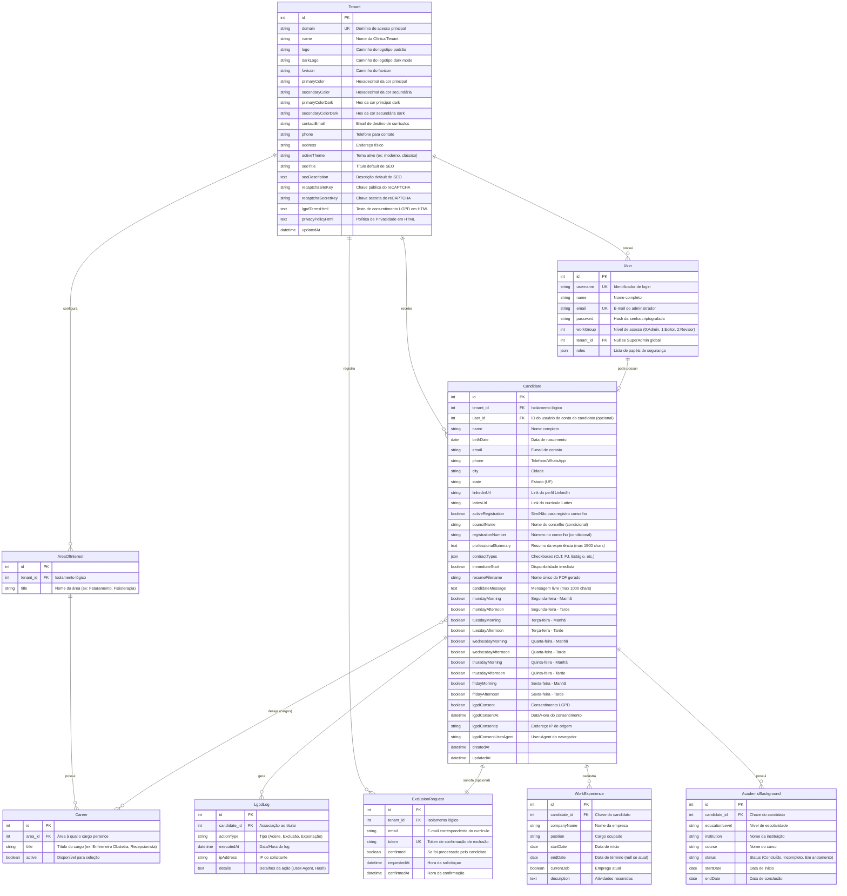

# Documento de Modelagem de Dados e Entidades (Data Model Specification)
## Portal Trabalhe Conosco Multi-Tenant — Procordis

---

### 1. Diagrama de Entidade-Relacionamento (ERD)

Abaixo está a representação conceitual das tabelas e seus relacionamentos. O isolamento lógico baseia-se na chave estrangeira `tenant_id` presente nas tabelas associadas.

---

### 2. Especificação Detalhada das Entidades

Todas as entidades que requerem isolamento dinâmico (todas com exceção do `Tenant` e dos `Users` de nível `ROLE_SUPER_ADMIN`) devem implementar a interface `TenantAwareInterface`. Isso habilitará a injeção do filtro SQL `tenant_filter` que automatiza a injeção de `AND tenant_id = :tenant_id` nas consultas SQL do Doctrine ORM.

#### 2.1 Entidade `Tenant`
Esta entidade centraliza as preferências visuais, de infraestrutura e dados de contato de cada domínio.

- **`id`**: `int` | Primary Key, Auto-increment.
- **`domain`**: `string` | Unique, obrigatório. Mapeia o host da requisição HTTP (ex.: `curriculo.marca.com.br`).
- **`name`**: `string` | Nome de exibição institucional do inquilino.
- **`logo`**: `string` | Nullable. Nome do arquivo da imagem de logo salva em disco.
- **`darkLogo`**: `string` | Nullable. Nome da imagem de logo dark.
- **`favicon`**: `string` | Nullable. Nome do arquivo favicon.
- **`primaryColor`**: `string` | Limite de 7 caracteres. Armazena o código de cor hexadecimal (ex.: `#0044cc`).
- **`secondaryColor`**: `string` | Limite de 7 caracteres (ex.: `#ffaa00`).
- **`primaryColorDark`**: `string` | Cor primária para dark mode.
- **`secondaryColorDark`**: `string` | Cor secundária para dark mode.
- **`contactEmail`**: `string` | E-mail de destino padrão que receberá os alertas de candidatos em formato PDF.
- **`phone`**: `string` | Telefone público institucional exposto no rodapé.
- **`address`**: `string` | Endereço físico opcional do tenant.
- **`activeTheme`**: `string` | Identificador do tema Twig a ser renderizado (ex.: `moderno` ou `classico`).
- **`seoTitle`**: `string` | Meta Title default para a página.
- **`seoDescription`**: `text` | Meta Description default para a página.
- **`recaptchaSiteKey`**: `string` | Nullable. Para ativação do Google reCAPTCHA.
- **`recaptchaSecretKey`**: `string` | Nullable. Para verificação do reCAPTCHA no back-end.
- **`lgpdTermsHtml`**: `text` | Nullable. Texto de consentimento LGPD formatável em HTML, exibido no formulário de inscrição.
- **`privacyPolicyHtml`**: `text` | Nullable. Conteúdo completo da Política de Privacidade em HTML, exibido no modal ou link da política de privacidade.
- **`updatedAt`**: `datetime` | Data da última alteração de configurações.

#### 2.2 Entidade `User`
Contas de acesso administrativo. Podem ser vinculadas a um Tenant ou ser globais.

- **`id`**: `int` | Primary Key, Auto-increment.
- **`username`**: `string` | Unique. Identificador de login.
- **`name`**: `string` | Nome completo do usuário.
- **`email`**: `string` | Unique, obrigatório. E-mail oficial.
- **`password`**: `string` | Hash seguro gerado via hasher nativo do Symfony.
- **`workGroup`**: `int` | Determina o nível RBAC:
  - `0`: Admin (acesso total às configurações locais e visualização de candidatos).
  - `1`: Editor/Recrutador (acesso focado em busca, triagem e download de currículos).
  - `2`: Revisor (permissão para auditorias LGPD e exclusão controlada).
- **`tenant`**: `ManyToOne` com `Tenant` | Nullable. Se nulo, define o usuário como **SuperAdministrador Global** (`ROLE_SUPER_ADMIN`). Se preenchido, limita o usuário ao escopo daquele Tenant (`ROLE_ADMIN` local).
- **`roles`**: `json` | Array contendo os papéis mapeados no Symfony (`ROLE_USER`, `ROLE_ADMIN`, `ROLE_SUPER_ADMIN`).

#### 2.3 Entidade `Candidate` (ou `Curriculum`)
Esta entidade reúne todas as informações inseridas pelo candidato no formulário "Trabalhe Conosco".

- **`id`**: `int` | Primary Key.
- **`tenant`**: `ManyToOne` com `Tenant` | Obrigatório. Garante que o candidato pertence a um único tenant. Exclusão do tenant gera exclusão em cascata (`onDelete: "CASCADE"`).
- **`name`**: `string` | Obrigatório. Max 150 caracteres. Assert: `NotBlank`, `Length(max: 150)`.
- **`birthDate`**: `date` | Nullable. Assert: `LessThan("-14 years")` para garantir idade de Jovem Aprendiz / CLT mínima.
- **`email`**: `string` | Obrigatório. Assert: `Email`, `NotBlank`.
- **`phone`**: `string` | Obrigatório. Máscara de telefone. Assert: `Regex` para validar formatações de telefone fixo/celular no Brasil.
- **`city`**: `string` | Obrigatório.
- **`state`**: `string` | Select de 2 caracteres.
- **`user`**: `OneToOne` com `User` | Nullable. Conta de login do candidato, permitindo retornar ao sistema para atualizar informações ou gerenciar dados.
- **`careers`**: `ManyToMany` com `Career` | Lista de cargos/profissões de interesse associados ao candidato (salvos na tabela pivot `candidate_career`).
- **`linkedinUrl`**: `string` | Nullable. URL do perfil do LinkedIn do candidato. Assert: `Url`.
- **`lattesUrl`**: `string` | Nullable. URL do currículo Lattes do candidato. Assert: `Url`.
- **`academicBackgrounds`**: `OneToMany` com `AcademicBackground` | Lista de escolaridades cadastradas pelo candidato (cascade persist/remove).
- **`workExperiences`**: `OneToMany` com `WorkExperience` | Lista de experiências profissionais cadastradas pelo candidato (cascade persist/remove).
- **`activeRegistration`**: `boolean` | Indica se o candidato possui registro ativo no conselho.
- **`councilName`**: `string` | Nullable. Nome do conselho (ex.: CRM, COREN). Obrigatório se `activeRegistration` for `true`.
- **`registrationNumber`**: `string` | Nullable. Número de registro. Max 30 caracteres. Obrigatório se `activeRegistration` for `true`.
- **`professionalSummary`**: `text` | Nullable. Resumo opcional geral de competências ou objetivo profissional. Assert: `Length(max: 1500)`.
- **`contractTypes`**: `json` | Lista de tipos desejados (ex.: `["CLT", "PJ"]`).
- **`immediateStart`**: `boolean` | Indica disponibilidade imediata de contratação.
- **`resumeFilename`**: `string` | Obrigatório. Nome ofuscado e único gerado para o arquivo PDF salvo de maneira isolada (ex: `/uploads/tenants/tenant_1/cv_5e43a9b1c.pdf`).
- **`candidateMessage`**: `text` | Mensagem livre adicional. Assert: `Length(max: 1000)`.
- **`mondayMorning`**: `boolean` | Disponibilidade para trabalhar na segunda-feira pela manhã.
- **`mondayAfternoon`**: `boolean` | Disponibilidade para trabalhar na segunda-feira à tarde.
- **`tuesdayMorning`**: `boolean` | Disponibilidade para trabalhar na terça-feira pela manhã.
- **`tuesdayAfternoon`**: `boolean` | Disponibilidade para trabalhar na terça-feira à tarde.
- **`wednesdayMorning`**: `boolean` | Disponibilidade para trabalhar na quarta-feira pela manhã.
- **`wednesdayAfternoon`**: `boolean` | Disponibilidade para trabalhar na quarta-feira à tarde.
- **`thursdayMorning`**: `boolean` | Disponibilidade para trabalhar na quinta-feira pela manhã.
- **`thursdayAfternoon`**: `boolean` | Disponibilidade para trabalhar na quinta-feira à tarde.
- **`fridayMorning`**: `boolean` | Disponibilidade para trabalhar na sexta-feira pela manhã.
- **`fridayAfternoon`**: `boolean` | Disponibilidade para trabalhar na sexta-feira à tarde.
- **`lgpdConsent`**: `boolean` | Obrigatório. Deve ser obrigatoriamente `true` no cadastro. Assert: `IsTrue`.
- **`lgpdConsentAt`**: `datetime` | Data e hora em que os termos LGPD foram aceitos.
- **`lgpdConsentIp`**: `string` | IP utilizado pelo candidato ao submeter o formulário (ex.: `189.44.11.23`).
- **`lgpdConsentUserAgent`**: `string` | String identificadora do dispositivo/navegador usado para fins de auditoria legal.
- **`createdAt`**: `datetime` | Gerado automaticamente.
- **`updatedAt`**: `datetime` | Gerado automaticamente.

#### 2.4 Entidade `WorkExperience` (Experiência Profissional)
Registros de experiências de trabalho anteriores ou atual do candidato.

- **`id`**: `int` | Primary Key, Auto-increment.
- **`candidate`**: `ManyToOne` com `Candidate` | Relaciona a experiência ao candidato proprietário. onDelete: "CASCADE".
- **`companyName`**: `string` | Nome da empresa empregadora. Assert: `NotBlank`, `Length(max: 150)`.
- **`position`**: `string` | Cargo ocupado. Assert: `NotBlank`, `Length(max: 150)`.
- **`startDate`**: `date` | Data de início no emprego. Assert: `NotBlank`.
- **`endDate`**: `date` | Nullable. Data de saída da empresa. Null se for o emprego atual.
- **`currentJob`**: `boolean` | Flag que indica se o candidato trabalha atualmente nesta empresa.
- **`description`**: `text` | Descrição resumida das funções e atividades desempenhadas. Assert: `NotBlank`, `Length(max: 1000)`.

#### 2.5 Entidade `AcademicBackground` (Formação Acadêmica / Escolaridade)
Registros do histórico educacional do candidato.

- **`id`**: `int` | Primary Key, Auto-increment.
- **`candidate`**: `ManyToOne` com `Candidate` | Relaciona a formação acadêmica ao candidato proprietário. onDelete: "CASCADE".
- **`educationLevel`**: `string` | Grau obtido. Assert: `NotBlank`, `Choice` (Ensino Fundamental, Ensino Médio, Curso Técnico, Ensino Superior Incompleto, Ensino Superior Completo, Pós-graduação, Mestrado, Doutorado).
- **`institution`**: `string` | Nome da instituição de ensino. Assert: `NotBlank`, `Length(max: 150)`.
- **`course`**: `string` | Nome do curso/habilitação. Assert: `NotBlank`, `Length(max: 150)`.
- **`status`**: `string` | Status do curso. Assert: `NotBlank`, `Choice` (Concluído, Incompleto, Em andamento).
- **`startDate`**: `date` | Nullable. Data de início dos estudos.
- **`endDate`**: `date` | Nullable. Data de término ou conclusão prevista.

#### 2.6 Entidade `AreaOfInterest`
Departamentos/Setores de atuação definidos pelo RH (ex.: Enfermagem, Administrativo, Faturamento).

- **`id`**: `int` | Primary Key, Auto-increment.
- **`tenant`**: `ManyToOne` com `Tenant` | Isolamento por inquilino.
- **`title`**: `string` | Título da área. Assert: `NotBlank`, `Length(max: 100)`.

#### 2.7 Entidade `Career` (Cargo Desejado)
Os cargos específicos mapeados dentro de cada área de interesse para recrutamento estruturado.

- **`id`**: `int` | Primary Key, Auto-increment.
- **`area`**: `ManyToOne` com `AreaOfInterest` | Associação ao departamento correspondente.
- **`title`**: `string` | Título do cargo específico (ex.: "Enfermeiro Obstetra", "Recepcionista"). Assert: `NotBlank`, `Length(max: 150)`.
- **`active`**: `boolean` | Se o cargo está disponível para seleção no portal de currículos.

#### 2.8 Entidade `LgpdLog`
Gravação fria de ações para fins de auditoria de proteção de dados.

- **`id`**: `int` | Primary Key.
- **`candidate`**: `ManyToOne` com `Candidate` | Relaciona a ação ao candidato (ou mantém de forma anonimizada em caso de deleção definitiva para comprovação perante a ANPD).
- **`actionType`**: `string` | Tipos válidos: `CONSENT_GIVEN` (cadastro), `DATA_EXPORTED` (candidato baixou seus dados), `DATA_DELETED` (dados removidos da base).
- **`executedAt`**: `datetime` | Timestamp da ação.
- **`ipAddress`**: `string` | IP da requisição.
- **`details`**: `text` | JSON contendo metadados (como agente de navegador e parâmetros excluídos).

#### 2.9 Entidade `ExclusionRequest`
Controle do fluxo de revogação de dados baseado em token temporário.

- **`id`**: `int` | Primary Key.
- **`tenant`**: `ManyToOne` com `Tenant` | Obrigatório.
- **`email`**: `string` | E-mail do candidato solicitante.
- **`token`**: `string` | Token único (UUID) de confirmação enviado ao e-mail.
- **`confirmed`**: `boolean` | Indica se o token foi validado pelo link do e-mail.
- **`requestedAt`**: `datetime` | Timestamp da solicitação do token.
- **`confirmedAt`**: `datetime` | Timestamp da exclusão física efetuada.
